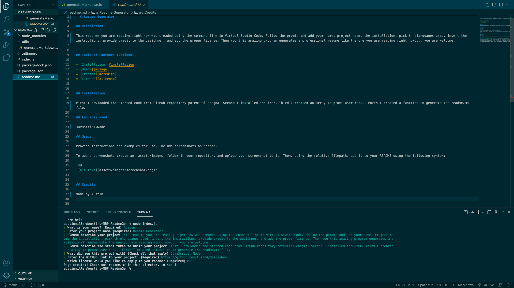

  # ReadmeGen

## Description 

This readme.md you are reading right now was created using the command line in Virtual Studio Code. Follow the prompts and add your name, project name, the installation, pick the languages used, insert the instructions, provide credit to the designer, and add the proper license. Then this amazing program generates a professional readme like the one you are reading right now.... you are welcome.

## Table of Contents (Optional)

* [Installation](#installation)
* [Usage](#usage)
* [Credits](#credits)
* [License](#license)

## Installation

First, I downloaded the starter code from GitHub repository potential-enigma. Second, I installed inquirer. Third, I created an array to prompt user input. Forth, I created a function to generate the readme.md file.

## Laguages used 

JavaScript,Node

## Usage 

## Credits

Made by Austin Miller

## License

https://opensource.org/licenses/MIT
Permission is hereby granted, free of charge, to any person obtaining a copy of this software and associated documentation files (the 'Software'), to deal in the Software without restriction, including without limitation the rights to use, copy, modify, merge, publish, distribute, sublicense, and/or sell copies of the Software, and to permit persons to whom the Software is furnished to do so, subject to the following conditions. The above copyright notice and this permission notice shall be included in all copies or substantial portions of the Software.THE SOFTWARE IS PROVIDED 'AS IS', WITHOUT WARRANTY OF ANY KIND, EXPRESS OR IMPLIED, INCLUDING BUT NOT LIMITED TO THE WARRANTIES OF MERCHANTABILITY, FITNESS FOR A PARTICULAR PURPOSE AND NONINFRINGEMENT. IN NO EVENT SHALL THE AUTHORS OR COPYRIGHT HOLDERS BE LIABLE FOR ANY CLAIM, DAMAGES OR OTHER LIABILITY, WHETHER IN AN ACTION OF CONTRACT, TORT OR OTHERWISE, ARISING FROM, OUT OF OR IN CONNECTION WITH THE SOFTWARE OR THE USE OR OTHER DEALINGS IN THE SOFTWARE.

